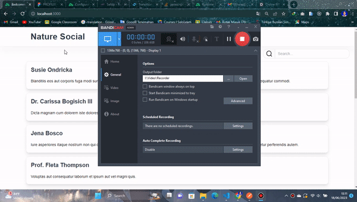
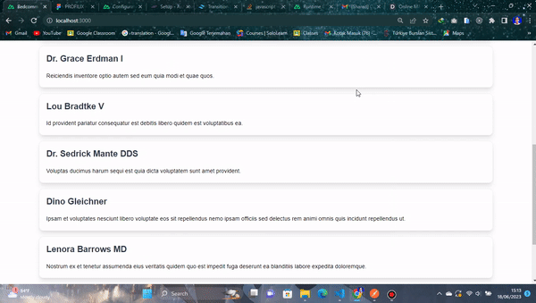
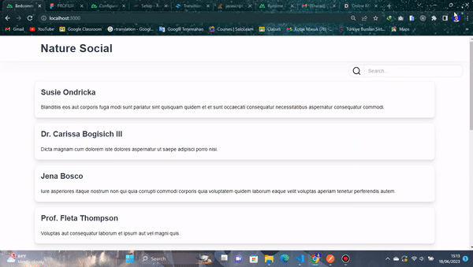

# Frontend Project Redcomm Indonesia Test

## Setup

Make sure to install the dependencies:

```bash
# npm
npm install

# yarn
yarn install

# to run
npm run dev

yarn run dev
# build
npm run build

yarn run build
```
```
1. Create file .env
2. Fill with NUXT_PUBLIC_API_BASE=http://localhost:[PORT]/api
3. Example NUXT_PUBLIC_API_BASE=http://localhost:8000/api
```
## Demo and Feature

1. Fetch And Loading



2. Load More



3. Use debounce Search, hit api when 1 second keyup


4. Responsive Design


